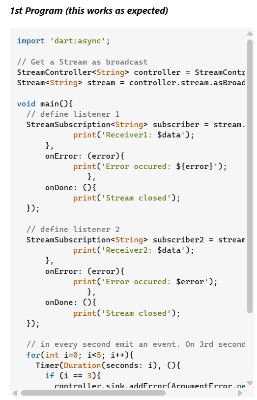
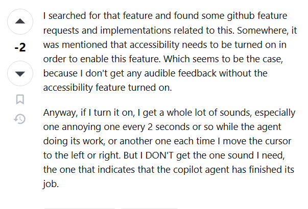

## Questions from a Smart Perspective

Who, what, when, where, and why? The five W's serve an important role in understanding the context behind a story. Similarly, we software engineers owe it to others and ourselves to paint these stories with our code. This allows room for gaining a deeper understanding for the craft and debugging. However, being able to ask questions is just as vital for growing as a software engineer. Though many of us would like to do everything ourselves, we do not have answers to everything and prohibiting ourselves from finding it will in the long run cause more problems. This does not mean that every question asked is a good question contrary to what some teachers might say. Since engineers are problem solvers, we must first attack the problem ourselves and then after exhausting our resources we ask thought-provoking, well-crafted questions. The last thing you want is to ask a question, and come back more confused or lost then you came in. And all of us have experienced that feeling, and that is partially due to the way we choose to ask the question. A simple "I do not know how this works" will not suffice. It takes a smart software engineer time to pinpoint the problem at hand and present it in a way that we are able to give a satisfactory answer.

## Smart Question, A New Hope

Stack Overflow is a Q&A forum that connects users like you and I to collaborate on a variety of programming problems/issues. Before the advent of chatbots such as ChatGPT and Copilot, this served as a great way to connect with very knowledgable people and get your questions answered. Also, it serves as a great place to find people who are good at asking smart questions. One of them was this user who was getting a "Bad state: Stream has already been listened to.", which relates to their implementation of dart streams for event handling. They prefaced the whole question by giving us some background on the work that he has done for this specific issues, with them talking about going through multiple platforms and not finding a clear answer. To me this shows some initiative and leads me to be more inclined to the problem that this user is discussing. Furthermore, this user was able to give us some of his code snippets to drive straight into. 

These code snippets are not screenshots and are formatted in a way that provides the least amount of work to access. Thus, with a smart question comes a satisfactory answer indicated with the green checkmark. The responder was able to call on his knowledge about the asBroadcastStream() and discovery that the issues coming from the creation of a unknown broadcast stream. This hopefully allowed the original poster the chance to learn about this function a bit more and reimplement the code in a way to fit their needs. The results of this smart question allowed for this poster to have a small collaboration with a different user and build upon his knowledge. Creating a situation in where both parties were able to either help or gain insight into something new.

## Smart Question, The Last Terrible Sequel

With a good original movie comes a forced unwelcomed medicore sequel. Which has nothing particular to deal with this persons issue, but everything to do with the way its formatted. This particular user was having problems with getting notifications on code Copilot, but it seems that he has given up continue his search by referencing that he thinks something needs to be turned on. And when he turned it on, it seemed that he got frustrated with the audio and just went straight to Stack Overflow to find a quick and easy solution. The user made no effort to describe the specifics of his problem and resorted to using Stack Overflow as a gloried Google search. This makes it feel like he had no intention of learning, but to skip the process and find the answer. And with that comes no response and negative perception of the question as there are two downvotes on it. 

## The End of a Question, The Beginning of More

Questions are one of the most important ways of communication in the world. It serves as a way to let your curiosity run wild and knowledge expand. Having it in your toolset, especially for a software engineer will help you improve tons. If you are able to craft a smart question it will set you up for well-craft responses that lets other understand your work and help you. And this does not only apply to software engineering, but many aspects of our lives. It helps us be more articulate and see from different perspectives. So when you are confused and truly need assistance, try asking a smart question.

## Fun Fact

The name Stack Overflow comes from a programming term where a program attempts to use more memory than is allocated on the stack.
