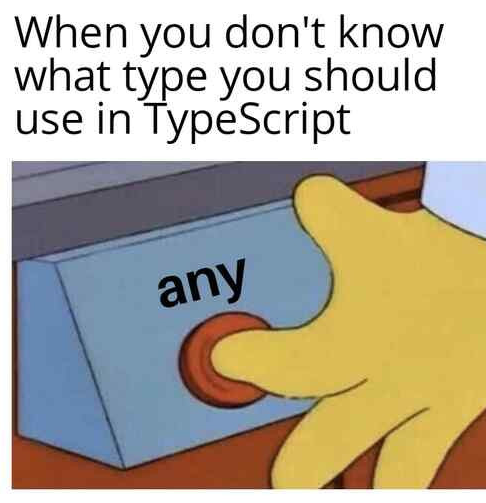

## Questions from a Smart Perspective

Who, what, when, where, and why? The five W's serve an important role in understanding the context behind a story. Similarly, we software engineers owe it to others and ourselves to paint these stories with our code. This allows room for gaining a deeper understanding for the craft and debugging. However, being able to ask questions is just as vital for growing as a software engineer. Though many of us would like to do everything ourselves, we do not have answers to everything and prohibiting ourselves from finding it will in the long run cause more problems. This does not mean that every question asked is a good question conrtary to what some teachers might say. Since engineers are problem solvers, we must first attack the problem ourselves and then after exhausting our resources we ask thought-provoking, well-crafted questions. The last thing you want is to ask a question, and come back more confused or lost then you came in. And all of us have experienced that feeling, and that is partially due to the way we choose to ask the question. A simple "I do not know how this works" will not suffice. It takes a smart software engineer time to pinpoint the problem at hand and present it in a way that we are able to give a satisfactory answer.

## Smart Question, A New Hope

A lot of us have ran into errors, and this person on Stack Overflow is not the expection. This person is trying to figure out why he is getting the error "Bad state: Stream has already been listened to.", but he did not just straight into Stack Overflow to post a response. They did some research beforehand by searching different forums for similar problems regarding their use of dart streams for event handling. Then, after all that research and not being able to find a clear answer, they then resulted to Stack Overflow to find fellow software engineers to see if they have further wisdom about the predictament they are having. On top of that, this user has provided both code snippets between his working code and the one that has been giving him the error. This illustrates the work they have done and what they are working on currently. And with a well-crafted question comes a satisfactory answer, the responder was able to provide insight regarding asBroadcastStream(). This helped gain some functionality that the user has missed and better understand the code he has worked on.

## Smart Question, A Terrible Sequel

This person is trying to get notifications when the code copilot agent finished its task. However, this person seemed like they did some light researching regarding the problem, and give up entirely to and relied solely on asking somebody. This resulted in no one responding to this question, as it is poorly written and sounds a bit entitled to an answer regarding their specific task. A response that I could imagine if given the time of day would be to ask the person to do a bit more research into the matter and design a more well defined idea of a reason and pictures of what they tried to do. 

## The End of a Question, The Beginning of More

Questions, the birth of curiosity and knowledge. And being able to utilize it in your toolset, you will thank yourself later. Smart questions are the way you can communicate not only in software engineering, but other aspects of life. The way one crafts a question is the way one lets others into the way your code is written and understand the perspective that you come from. This helps yourself and other understand where are coming from and the mistakes that you have been making. Therefore it is important to have well-crafted questions to develop satisfactory answers and the development hole you might be in. So being alert about the problem and doing your best to solve it first, then ask has been very appreciated because it shows that you have tried and need just a bit more assistance. 
