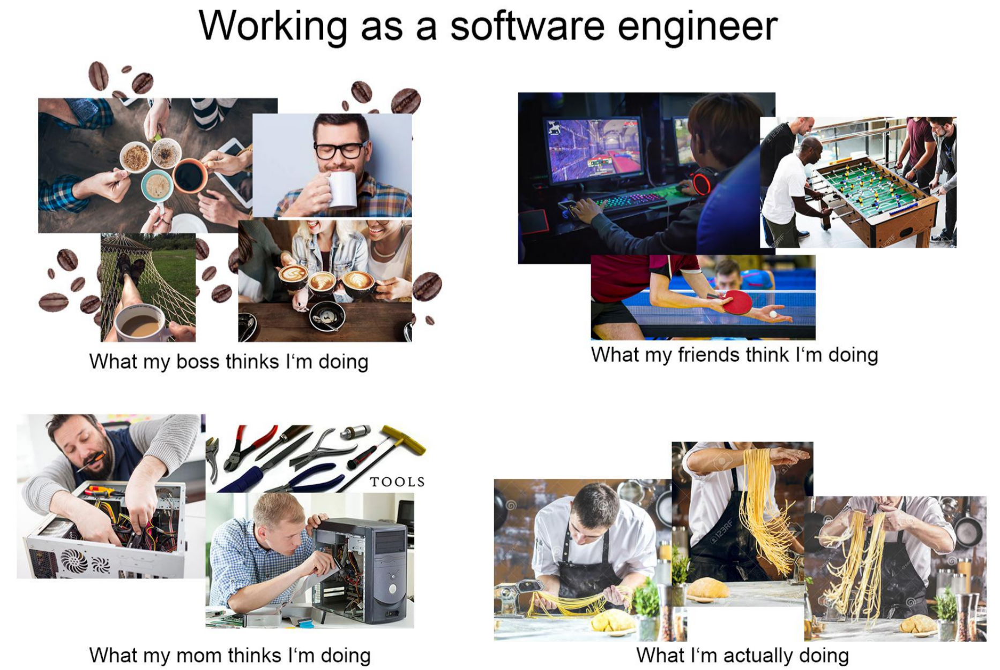

## Software Engineering the Intro

Software engineering is the process in which software/code is developed, tested, and maintained. Think of the websites you visit daily, that in itself is part of the software engineering cycle albeit probably in the maintanance phase. However, this process is all but foreign to me with some key phrases being brought up here and there. Such as the agile and waterfall model that describes certain processes of software development, but other than that I am in the dark. But now this semester, I am taking a software engineering course which in many ways will be my foot in the door for software engineering.

## The Hook

Since I have worked on big teams with large codebases, I am interested in how people are able to work together in a manner that allows for the fast and efficient development of their systems. Personally I had issues with the collaboration aspect of GitHub and people having branches that make significant changes when remerging back into main. I have been trying to have a more fluid and efficient way for people to work together without conflicting code. I know the process of software engineering is having clear paths for development like the agile and waterfall models, and I am most interested in that. Understanding the process of how different types of software engineering warrants different methods of action. Another aspect that interested me was making unit tests and how they would work in the type of projects that I am working on. I did work with unit test briefly in my object oriented programming class, but that was with little guidance and implementation. However, I want to be able to see how software engineers approach making sure their code pass certain standards when making deployable code. 

## The End?

The most important aspect to me about software engineering is learning about the principles to quickly and efficiently develop software for huge overarching projects such as website development and maybe robotics. Being able to harness this knowledge and apply it to a different part of my career would be ideal for understanding and utilizing software principles to propel the skills that I have now. I am still a novice programmer, and I want to be able to continue to improve and learn indefinitely.
