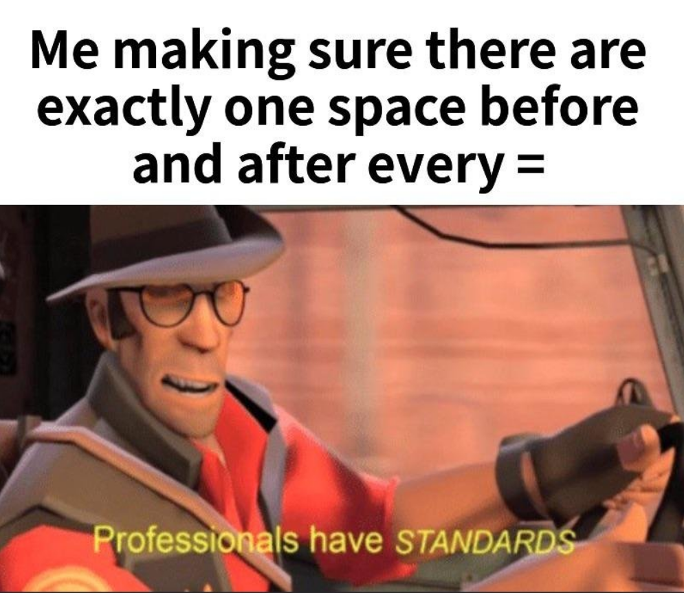

## A Standard I Believe In

Where are your brackets when coding a function? Do you have one in the same line as the function declaration? 

```
int addNum(int a, int b) {
  return a + b;
}
```
Or do you have it on separate line?
```
int addNum(int a, int b)
{
  return a + b;
}
```
Personally I prefer the former as it was the standard that I started with. However, many people do the latter and nothing is inherently wrong until it clashes with someone elses coding standard. It creates confusion and breaks the consistency when you read it, therefore when working on large codebases it is important to establish a foundation of rules. Unless you are required to write the most efficient code in the world, it is important that you and most important other people can read/understand it. The goal is to make code that is easy to follow and adaptable for the overall development cycle. If you make something that is confusing and extremly convoluted, it deters others from wanting to help you or assist you when you are having a bug. It would just be extra work for me to figure out what you are doing, limiting the scope of efficency and reliability. 

## Return of the Keyboard Warrior

There are many obvious ways to make ones code more readable and consistent, but you have to make those standards known. You cannot expect one person to adhere to the way you code without letting them know the reasoning and the function behind it. Despite that there are some standards that are important to all programmers. One of them is giving variables names that make sense. I understand if the code is rough and in the early stages of development, but having finalized code with variables declared with just a single letter is not acceptable. Imagine looking back months from now at your code just to find that you had 'a' and 'b' as variable names and have to take even longer to figure out what it means. The same applies to function names as well, simply name a function 'doesSomething()' does not really bring any ease to your life. Every function does something, so be specific. Another thing to note is having functions that do too much things. In the past I have made the mistake where I a function that I created simply does too much. The goal is to keep a function to do exact what you named it to do. If you it starts getting too complex, consider making another function that simplifies what you are doing. The last thing you want is to have someone use your function and it return something unexpected. Be clear and consise. Another thing to not is consistency with variable and function naming is camelCase, capitalization, and underscores. 

```
const int PI = 3.14 // Usually used for constants
int ledOn = true // camelCase
int led_on = true  // underscores

int AddNum(int a, int b) {    // Capitalization
  return a + b;
}

int addNum(int a, int b) {    // camelCase
  return a + b;
}
```

Using camelCase and underscore are standards that are used to specify variable names with more than one word. As show above, camelCase involves the first word to be lowercase and the rest to be capitalized. While underscores are more simple by using it to separate the words. What is shown above can change from company to company, but constant are usually maintained with all caps. Functions however can either be camelCase or capitalized, and that is still based on how the specific group/company wants it to be formatted. A final note that bares quite importance is how you space out your code, some choose to have no spaces but other choose to break the continous lines with spaces. Personally speaking, I prefer using spaces as it helps with readability which I find really important. However, some people do not use spaces or indents which can make it hard to read at times. 

## Learning Over Multiple Lines

In a world where there is a lot of confusing and seemingly impossible tasks, being able to articulate is more important than ever. And code is just one way of expressing that you understand the art of it. I aim to write code that is digestable and allows for maintainability. And at this moment in time that part is still difficult to me. I am a novice in many ways and I understand that. However, if I keep working towards the path of spending the time to make things just a bit more convinent, it does everyone a bit of justice. So I impore you to take the steps to write good code that allows for growth and learning, knowing that I will as well.
