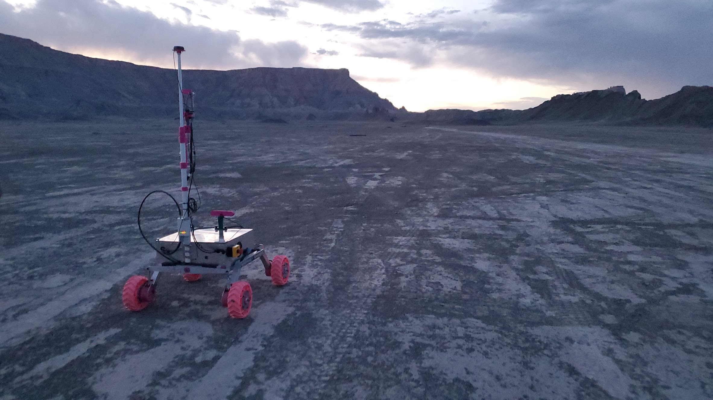

The capstone project serves as a year long project that aims to utilizes ones knowledge obtained over the course of high school to a singular project. It consisted of three different branches, engineering, health, and business. 

I was part of the engineering discipline and decided to team up with a fellow engineering student to create a holonomic drive system. However, due to the lack of funding and mentorship this project was built using old VEX Robotics parts which limited the scope of the project signicantly. 

The holonomic drive system describes a different type of 

A quick video that encapsulates the progress made last school year: [Team RoSE URC 2025 SAR](https://www.youtube.com/watch?v=bVW3kchtqlg)

Here is the Github organization: [Team RoSE](https://github.com/RoboticSpaceExploration)
