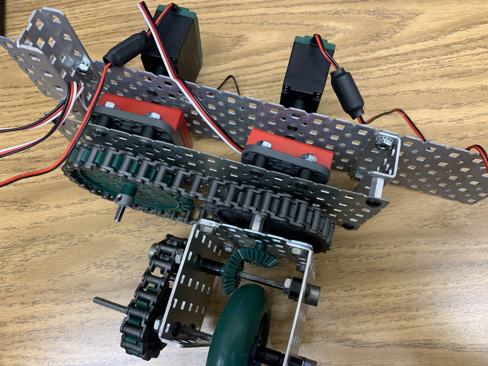

The capstone project serves as a year long project that aims to utilizes ones knowledge obtained over the course of high school to a singular project. It consisted of three different branches, engineering, health, and business. 

I was part of the engineering discipline and decided to team up with a fellow engineering student to create a holonomic drive system. However, due to the lack of funding and mentorship this project was built using old VEX Robotics parts which limited the scope of the project signicantly. 

The holonomic drive describes an omnidirectional robotic drive that allows each individual wheel to move and rotate simultaneously in any direction. This is done by having a motor for rotation and another motor for backward and forward motion. Therefore thoughtout the course of the year we designed and test different iterations of the drive. Specifically I worked on the programming of the drive which challenged me because of the way optimized angles worked. Optimized angles involves the optimal way to traverse a circle which represents the rotation. 

This capstone project became one of those projects that pushed me to pursue this type of engineering discipline. I enjoy being able to work with the electronics, but also being able to create software on top of that. The intersection between physical and purely digital motivated me to work on something like this. And if you are able to find that niche, that intersection in life you will truly find what makes you tick.
