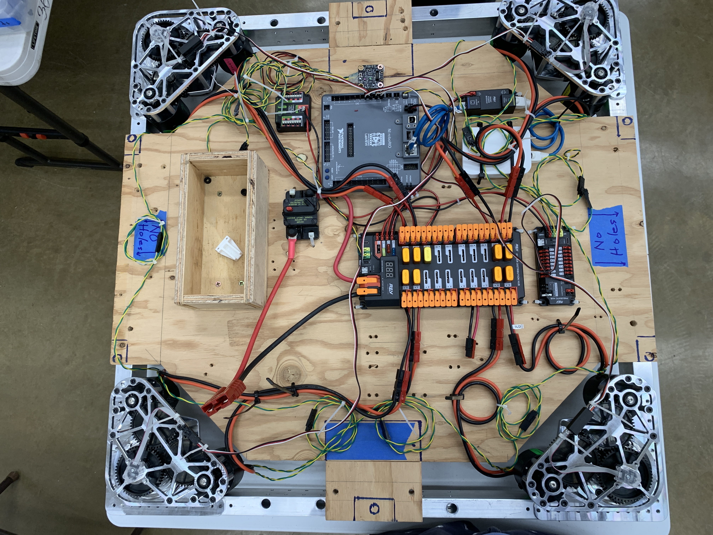

Team Kika Mana, was a FRC (First Robotics Competition) team that I was part of in high school. And this team single handedly brought me to where I am today, a student still interested in robotics. 

At the beginning of each year, FRC streams the reveal of that year's competition and what it entails. Thus, each year hundreds and hundreds of teams work until March to compete against each other. That is what got me hooked, the opportunity to work with like-minded individuals to reach a common goal is amazing. Quite frankly I learned about how much I didn't know and the work that goes into the creating a robot. This was a stepping stone for the career I wanted to pursue, robotics.

The team was broken up into two main subsystems, electrical and mechanical. The mechanical were in charge of designing and building the robot, while electrical were responsible for creating the software on top of it. This included the arm, drive, and the sensors need for that year's theme. Alongside that both the mechanical and electrical would work closely to wired up the robot and do testing. This made the team really close and allowed me to make friends that I still work closely with today. It was the sheer amount of time and struggle that brought us together and persevere. 

I mostly worked on the electrical team, and since I was new I spent a good chunk of the time learning the Java programming knowledge. This was the first programming language that I learned and it was serves as the basis of my understanding of code today. I still remember the struggles of understanding classes and retrieving sensor data. After my first year of learning, I was fortunate enough to be the one that led the team. And by doing so I was able to develop an interest in how the autonomy of the robot worked and working with the special holonomic drive even though I was still a novice.

Nonetheless, it served to be very fruitful as I am working to figure out how autonomous systems work and integrate it into my school projects. It was a special time as I didn't know what I wanted to pursue and came at a critical time in my life. Looking back at it now, it was a case of being there at the right time and place. And I am very fortunate to have such an opportunity to meet amazing people and simultaneously build on my knowledge. To this day I am still learning and will continue for a very long time as the journey has just begun. 

If you are interested here is a link to the FRC website: [First Robotics Competition](https://www.firstinspires.org/robotics/frc)
