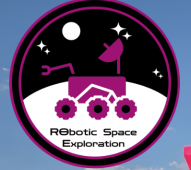

Team Robotic Space Exploration, Team RoSE, is the robotics team in the University of Hawaii at Manoa which specializes in creating a mock Mars rover for a international competition called URC, University Rover Challenge. 

The competition is broken down into four main missions: 

- **Science**

  A mission that involves collecting a soil sample from various sites to preform basic science evaluation of the sample onboard. In order to discover if there were any microbial life that was acquired from the sample sites.

- **Delivery**

  A teleoperated mission that involves the rover finding, picking up, and delivering objects to astronauts on the field while also traversing through terrain of increasing difficulty

- **Equipment Servicing**

  A teleoperated mission that requires the rover to interact with a mock lander to preform certain task, including undo a latch, opening a drawer, and typing in a launch key. Culmating in the precise movement of both the robotic arm and differential drive.

- **Autonomous Navigation**

  The rover autonomously must travel to two GNSS location, three post with AR tags, and two objects which requires a careful balance of sensors to approximate its location and movement.

Initially, I joined as a way to continue the passion I had towards the field of robotics. And through the student lead component of the project, I learned about the difficulties that came with differing knowledge gaps and team coherency. 

This past school year however I took on more of a leadership role that involved management of the entire software team. Including running weekly meetings, tracking the progess of the different sub-disciplines, and of course developing the software, mostly the differential drive for me specifically. Though this only describes a third of the team which also includes the mechanical and electrical team. 

A quick video that describes the progress of the rover last school year is link [here](https://www.youtube.com/watch?v=bVW3kchtqlg)

The code repo for last year is also here: [urc_2025](https://github.com/RoboticSpaceExploration/urc_2025)
